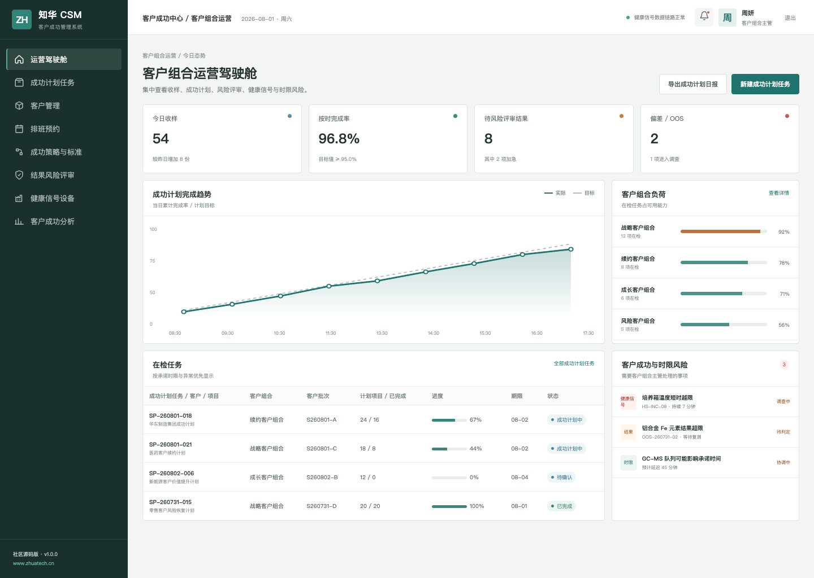
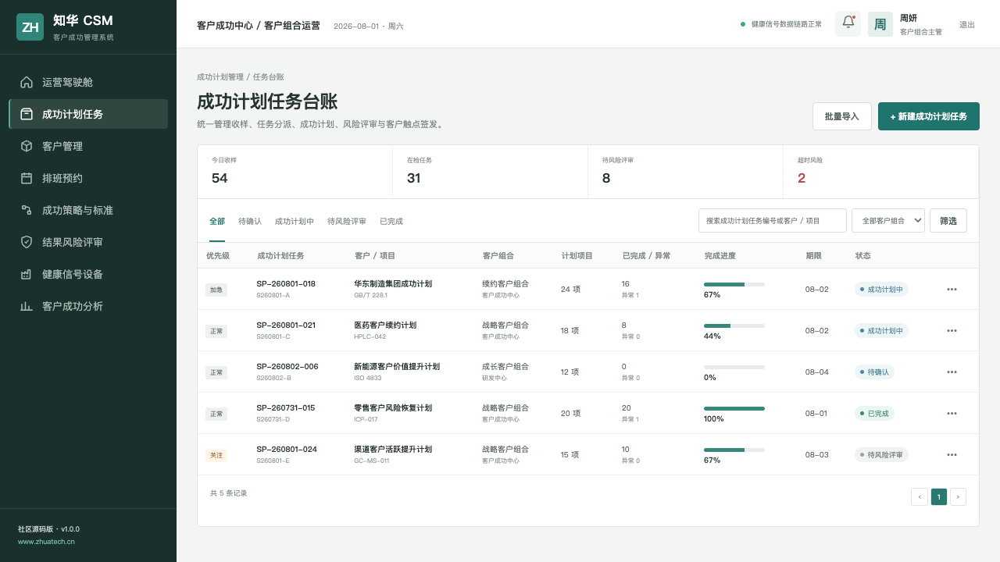
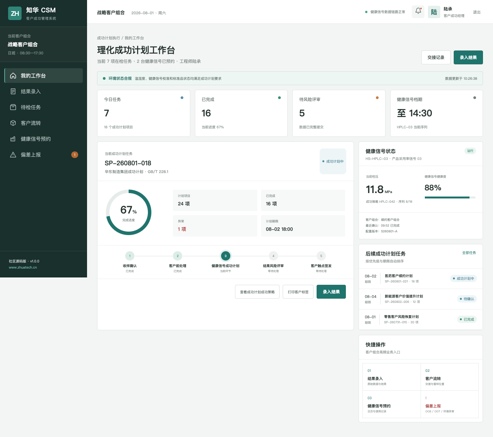

# 客户成功管理系统 / ZhuaTech CSM

> Customer Success Management community source project by ZhuaTech

[](backend/pom.xml) [](frontend/package.json) [](compose.yaml) [](LICENSE)

## 项目说明

上海如静知华信息科技有限公司以真实企业岗位分工为背景构建了这套 CSM 社区源码版：围绕客户目标、健康度、风险和续约，把交付后的价值经营变成持续动作。 更多企业数字化方案请访问[知华科技官网](https://www.zhuatech.cn/)。

| 核心流程 | 使用角色 |
| --- | --- |
| 客户接入 → 目标共识 → 成功计划 → 健康监测 → 风险干预 → 续约复盘 | 客户成功经理、CSM 负责人、风险评审人、系统管理员 |

## 页面与交互

### 客户成功运营驾驶舱



### 成功计划与风险台账



### 客户成功经理工作台



截图由仓库中的 Vue 应用实际运行后生成，展示的业务数据均为虚构演示数据。

## 能力清单

1. 客户组合、成功计划与里程碑
2. 健康信号、风险评审和干预任务
3. 触点记录、价值实现与续约预测

## 技术方案

| 部分 | 技术与职责 |
| --- | --- |
| 后端 | Java 21、Spring Boot、Spring Security、JPA、Flyway |
| 前端 | Vue 3、Pinia、Vue Router、Axios、Vite，响应式管理端与 H5 岗位端 |
| 数据 | MySQL 8；H2 集成测试 |
| 交付 | Docker Compose、Nginx、环境变量配置 |

Java 工程包名为 `cn.zhuatech.csm`，数据库名为 `zhuatech_csm`。角色覆盖客户成功经理、CSM 负责人、风险评审人、系统管理员。

## 开始运行

仅看演示界面：

```bash
cd frontend
npm install
npm run dev:demo
```

打开 `http://localhost:5173`。管理端账号 `planner / Demo@2026`，岗位端账号 `operator / Demo@2026`。

完整启动：

```bash
cp .env.example .env
# 修改数据库密码与 JWT_SECRET
docker compose up --build
```

## 安全提醒

仓库中的账号、客户、指标、工单和经营数据均为虚构演示数据。正式落地时应更换默认密码与 JWT 密钥，配置 HTTPS、最小权限、数据库备份、操作审计、脱敏策略，并按照所在行业完成安全与合规评估。

## 授权方式

本工程仅允许个人、非商业性的学习、研究和技术交流，**不得商用**。企业内部使用、生产部署、SaaS、客户交付、收费培训、咨询实施及品牌替换，均须事先取得上海如静知华信息科技有限公司书面授权。完整条款见 [LICENSE](LICENSE)。

需要深度开发、私有化部署、系统集成或商业授权，请访问[知华科技官网](https://www.zhuatech.cn/)，也可扫码添加微信咨询：

| 微信咨询 1 | 微信咨询 2 |
| --- | --- |
|  |  |

关键词：CSM 源码、客户成功系统、客户健康度、续约管理、Java CSM、Vue CSM、知华科技、上海如静知华信息科技有限公司。

## 客户续费准备度

`POST /api/admin/renewal-readiness` 将产品采用、客户健康、未解决工单、高层关系和增购机会转成续费准备分。风险客户会进入升级队列，并获得采用提升、问题清零与高层关系建设建议。
